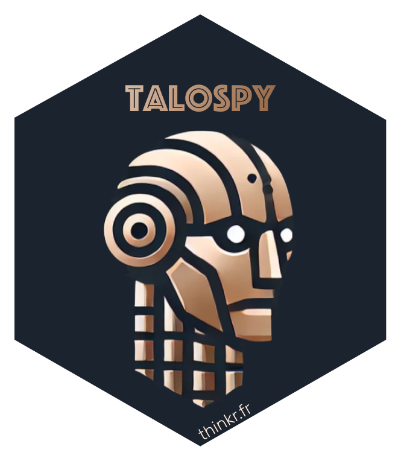

# TalosPy </a>

[](https://github.com/cookiecutter/cookiecutter)


Install [pipx](https://pipx.pypa.io/stable/installation/)

1. Install cookiecutter

```bash
pipx install cookiecutter
```

2. Use a Github template

```bash
pipx run cookiecutter gh:ThinkR-open/talospy
```

3. Answer the questions

4. Install and use poetry shell

```bash
poetry self add poetry-plugin-shell
```

```bash
cd name_of_your_project
poetry shell
```

5. Install the dependencies

```bash
poetry install
```

6. Run the application

```bash
poe runshiny
```
